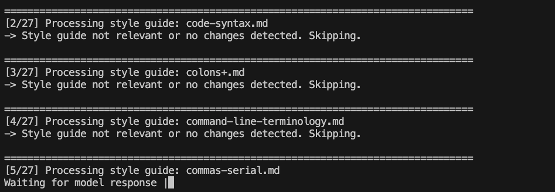

# AutoDocsEditor

`AutoDocsEditor` helps your documentation conform to the [Google Developer Documentation Style Guide](https://developers.google.com/style) by using *large language models* (*LLMs*). This is a large style guide (71 pages!), so the `AutoDocsEditor` breaks up the job into stages, proposing incremental edits to a document. This makes the process of hand-checking a long document against 71 individual style rules less tedious.




## Quick start

To get started, export your OpenAI key (or put it in a `.env` file):

```shell
    export OPENAI_API_KEY="YOUR_API_KEY"
```

Run the `auto_docs_edit.py` script against a target Markdown document:

```shell
    uv run --script auto_docs_edit.py docs/your_article.md
```

This script processes the Markdown file against every page of the style guide (stored locally in the `style/` directory). The script pauses between each set of edits, giving you the opportunity to review the proposed edits and commit the incremental changes before moving on to the next set of style rules. The script itself doesn't touch Git.

Note: we recommend using `o4-mini` for better results.

### Skip style rules

If you are resuming a run, you can skip style rules you have already processed:

```shell
    uv run --script auto_docs_edit.py \
        --skip-through commas.md docs/your_article.md
```

This example skips every style rule **up to and including** the `commas.md` file.

You can also press the **`ESC`** key to interrupt the current task and skip to the next task.

### Final pass sweep

After you have iterated through the full style guide once and made additional manual edits, you can run a **quick compliance sweep** over only the most error-prone rules:

```shell
    uv run --script auto_docs_edit.py --final-pass docs/your_article.md
```

The script will process **only** those style guide pages whose filenames end with a `+`, for example `00-tone+.md`.

### YOLO mode (non-interactive)

Run the script with `--yolo` to automatically accept every proposed edit and skip the manual review pauses:

```shell
    uv run --script auto_docs_edit.py --yolo docs/your_article.md
```

YOLO mode is not recommended because mistakes will compound.

### Bulk PR automation

If you want to **batch-apply** the style rules and open one draft pull-request per document, use `bulk_pr_autodocs.py`.

1. Ensure you have a local clone of the GitHub repository you want to patch.
2. Export a **personal access token** with `repo` and `gist` scopes (required to push branches and create secret gists):

```shell
export GITHUB_TOKEN="YOUR_GITHUB_PAT"
```

or put it in a `.env` file:
```text
GITHUB_TOKEN=YOUR_GITHUB_PAT
```

3. Create a *greenlist* text file that lists the Markdown paths (relative to the repo root) you want to process, for example:

```text
# greenlist.txt=
docs/getting-started.md
docs/advanced/configuration.md
```

4. Run the bulk script:

```shell
uv run --script bulk_pr_autodocs.py \
  --repo /path/to/local/clone \
  --greenlist greenlist.txt
```

Flags:
* `--dry-run` – print actions without touching GitHub.
* `--continue-on-error` – keep processing even if one document fails.
* `--base-branch` and `--remote` – customise the target branch/remote.

For every listed file the script will:

1. Create a branch `docs/auto-edit-<slug>` inside your clone.
2. Run `auto_docs_edit.py` in YOLO mode.
3. Push the branch and open a **draft** PR against `<base-branch>`.
4. Upload the LLM session log to a **secret gist** and link to it from the PR description.
5. Archive a copy of the log under `logs/bulk_pr_logs/`.

## Incident logs

If an edit fails to apply (for example, the script can't find the snippet), the script records a log file under `incidents/`, so you can inspect what went wrong.

## Differences to the official style guide

- Moved some guides that are irrelevant for my use case to `archive/`.
- Deleted Google- and Android-specific style rules.
- Simplified some style rules to make them more "atomic" and less monolithic.
- Added a few LLM hints to prevent common LLM mistakes while applying the style guides (for example, "Do not apply this style guide to code blocks.").
- Added a few style precedence rules to enforce an ordering of the style guides.
- Dropped preference for `_` over `*` for italics.
- Removed internal links between style rule pages, since the LLM applies one set of style rules at a time and also can't follow the links.
- Added some personal style rules. These personal style rules are prefixed with `PERSONAL-`.
- Removed HTML-specific style rules.

## Set style rule precedence

The order in which the style rules are applied is important because subsequent edits may revert previous edits. The default order is alphabetic. Therefore, to enforce an ordering, you can add prefixes to the style guide names. The script applies the prefixes `00-`, `01-`, `02-` in that order, before non-numeric style guides. Conversely, the script applies `z-` last.

## Planned features

- [ ] Support for applying the script to Jupyter notebooks.
